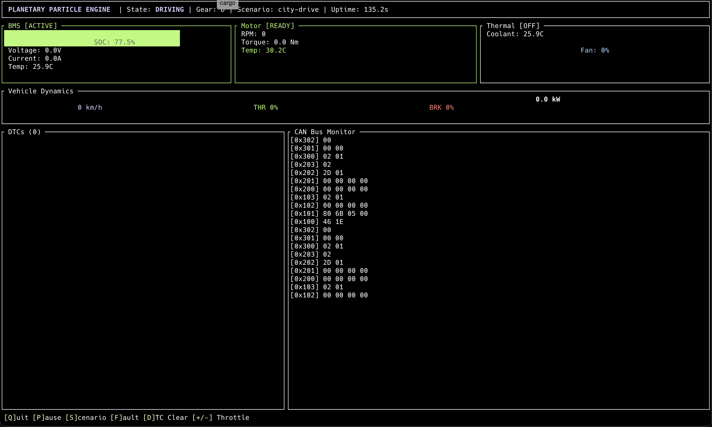

# Planetary Particle Engine (PPE)

A simulation-first vehicle operating system written in Rust.

PPE models a complete electric vehicle software stack — from CAN bus communication and hardware abstraction up through physics simulation and a real-time TUI dashboard — all without requiring physical hardware.



## Architecture

```
Layer 7: TUI Dashboard           <- ppe-dashboard
Layer 6: Diagnostics (OBD-II)    <- ppe-diagnostics
Layer 5: Physics Simulation      <- ppe-sim
Layer 4: RT Scheduler            <- ppe-scheduler
Layer 3: Subsystems              <- ppe-subsystems
Layer 2: State Machine           <- ppe-state
Layer 1: CAN Bus + HAL           <- ppe-can, ppe-hal
Layer 0: Core Types              <- ppe-core
```

## Crates

| Crate | Description |
|-------|-------------|
| `ppe-core` | Unit newtypes (Voltage, Current, SpinRate, etc.), SimClock, error types, DTCs |
| `ppe-can` | CAN frames, virtual CAN bus (crossbeam-based), bus nodes, ID filtering |
| `ppe-hal` | Sensor/Actuator traits, mock sensors with noise model, lock-free sensor handles |
| `ppe-state` | Vehicle FSM (7 states), sub-FSMs (BMS, Motor, Ener-D Reactor) |
| `ppe-scheduler` | EDF-like real-time scheduler, software watchdog |
| `ppe-subsystems` | BMS, Motor Controller, Thermal Management, Ener-D Reactor |
| `ppe-diagnostics` | OBD-II responder (Mode 01/03), DTC manager, freeze frames |
| `ppe-sim` | Vehicle physics (dynamics, electrical, thermal), 10 built-in scenarios |
| `ppe-dashboard` | ratatui TUI with gauges, CAN monitor, DTC viewer, reactor panel |

## Subsystems

### Battery Management System (BMS)
Monitors pack voltage, current, and temperature. Estimates state-of-charge via coulomb counting. Detects over-temperature, under-voltage, and cell imbalance faults.

### Motor Controller
Tracks RPM, torque, and motor temperature. Applies power derate at high temperatures. Detects stall and over-temperature conditions.

### Thermal Management
Controls cooling fan speed based on coolant temperature thresholds. Four cooling states from off through emergency cooling.

### Ener-D Reactor
A momentum-based energy source that harvests kinetic energy from vehicle motion. Features a 6-state FSM (Dormant → SpinUp → Sustaining → Overdrive → Critical → Meltdown), containment field physics with cubic degradation at high power, and plasma temperature modeling. Publishes telemetry on CAN IDs 0x500–0x505.

## Physics Simulation

The physics engine models:
- **Vehicle dynamics** — drag, rolling resistance, wheel torque, acceleration
- **Electrical system** — battery voltage/current, SOC depletion, internal resistance
- **Thermal behavior** — motor heating, coolant loop, radiator cooling
- **Reactor coupling** — momentum flux from vehicle motion feeds the Ener-D Reactor

## Scenarios

| Scenario | Description |
|----------|-------------|
| `idle` | No throttle or brake input |
| `city-drive` | Repeated accel/brake cycles simulating urban driving |
| `highway-cruise` | Constant highway-speed throttle |
| `full-throttle` | Maximum acceleration |
| `thermal-stress` | Sustained high throttle to heat the motor |
| `range-test` | Gentle acceleration until battery depletes |
| `fault-injection` | Triggers vehicle faults for testing |
| `accel-synchro` | Synchronized acceleration for reactor testing |
| `turbo-duel` | High-power acceleration burst |
| `reactor-stress` | Extreme conditions to stress-test the reactor |

## Getting Started

```bash
# Build
cargo build --workspace

# Run tests
cargo test --workspace

# Launch the dashboard (default: city-drive scenario)
cargo run --bin ppe-daemon

# Run a specific scenario
cargo run --bin ppe-daemon -- --scenario reactor-stress

# Headless mode (no TUI)
cargo run --bin ppe-daemon -- --headless

# Diagnostic CLI
cargo run --bin ppe-diag -- list-pids
cargo run --bin ppe-diag -- pid rpm
cargo run --bin ppe-diag -- dtcs
cargo run --bin ppe-diag -- sniff --duration 5
cargo run --bin ppe-diag -- sniff --filter 0x500
```

## Dashboard Controls

| Key | Action |
|-----|--------|
| `q` | Quit |
| `p` | Pause / Resume |
| `s` | Cycle scenarios |
| `+` / `-` | Adjust throttle |
| `f` | Inject fault |
| `d` | Clear DTCs |

## CAN Bus Layout

| Range | Subsystem |
|-------|-----------|
| `0x001–0x002` | Emergency (E-Stop, Heartbeat) |
| `0x100–0x10F` | BMS (SOC, Voltage, Current, Temp, Status) |
| `0x200–0x20F` | Motor (RPM, Torque, Temp, Status) |
| `0x300–0x30F` | Thermal (Coolant Temp, Fan Speed, Status) |
| `0x400–0x40F` | Vehicle (State, Speed, Throttle, Gear) |
| `0x500–0x50F` | Ener-D Reactor (Status, Spin, Power, Containment, Plasma, Flux) |
| `0x7DF / 0x7E8` | OBD-II (Request / Response) |

## License

MIT
